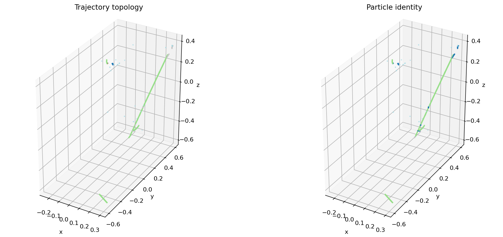
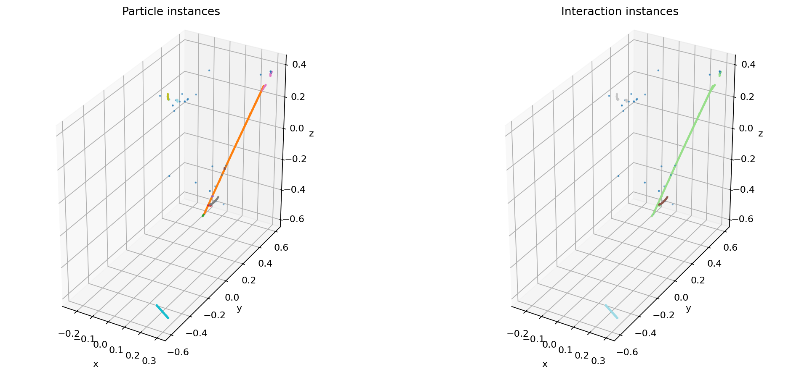

# Explore Panda

Panda turns a sparse LArTPC point cloud into reusable point features, semantic
labels, particle instances, or interaction instances. This tutorial starts with
one real event from
[PILArNet-M-mini](https://huggingface.co/datasets/DeepLearnPhysics/PILArNet-M-mini),
then shows the exact calls used for each released checkpoint.

The plots below are live Plotly scenes. Drag to rotate, scroll to zoom, hover a
point for coordinates, and click a legend entry to isolate a class or instance.
Every plotted point comes from mini **test event 0** after Panda's deterministic
inference transforms—these are not screenshots copied from another repository.

:::{admonition} TODO — add the released models' generated panels
:class: pimm-todo

The CPU event panels below were regenerated and verified in this checkout. Run
the L4 **Docs figures** workflow, review the four released checkpoints' outputs,
and check in its semantic, base-feature, particle-prediction, and
interaction-prediction panels. Until that reviewed artifact is available, this
page intentionally shows only the real event views rather than invented model
outputs. The workflow executes the checked-in figure-generation source; it does
not copy plots from Panda's repository.
:::

## 1. Build the dataset and inspect an event

The example downloads only `test/*.h5` from the mini dataset, constructs a
{py:class}`~pimm.datasets.pilarnet.h5.PILArNetH5Dataset`, and applies the same
test-time transform shape expected by Panda:

```python
TEST_TRANSFORM = [
    dict(type="NormalizeCoord", center=[384, 384, 384],
         scale=768 * 3**0.5 / 2),
    dict(type="LogTransform", min_val=0.01, max_val=20.0),
    dict(type="GridSample", grid_size=0.001, mode="train",
         return_grid_coord=True),
    dict(type="ToTensor"),
    dict(
        type="Collect",
        keys=("coord", "grid_coord", "energy", "segment_motif",
              "segment_pid", "instance_particle", "instance_interaction",
              "segment_interaction"),
        feat_keys=("coord", "energy"),
    ),
]
```

Download the test shard into the Hugging Face cache, then pass a normal pimm
dataset configuration to
{py:func}`~pimm.datasets.builder.build_dataset`:

```python
import numpy as np
from huggingface_hub import snapshot_download
from pimm.datasets import build_dataset

data_root = snapshot_download(
    repo_id="DeepLearnPhysics/PILArNet-M-mini",
    repo_type="dataset",
    allow_patterns=("test/*.h5",),
)

dataset_cfg = dict(
    type="PILArNetH5Dataset",
    data_root=data_root,
    split="test",
    revision="v2",
    transform=TEST_TRANSFORM,
    energy_threshold=0.13,
    min_points=1024,
)
dataset = build_dataset(dataset_cfg)

# GridSample chooses one representative per occupied voxel. Fix the seed so
# this tutorial selects the same representatives every time.
np.random.seed(7)
sample = dataset[0]
```

`sample` is already in Panda's single-event input format because the final
`Collect` transform creates `feat` and `offset`:

```python
sample["coord"].shape       # torch.Size([1175, 3])
sample["grid_coord"].shape  # torch.Size([1175, 3])
sample["feat"].shape        # torch.Size([1175, 4]): x, y, z, energy
sample["offset"]             # tensor([1175])
```

The resulting event has **1,175 points**. The input feature at each point is
normalized $(x,y,z)$ plus log-scaled energy; the model-facing dictionary also
contains integer grid coordinates and an offset delimiting the event.

<iframe
  title="Interactive energy deposition for PILArNet-M-mini test event 0"
  src="../_static/tutorials/panda-event-energy.html"
  style="width:100%;height:620px;border:0;border-radius:10px"
  loading="lazy"
></iframe>

The two label views answer different questions. **Trajectory topology** says
what a local shape looks like (shower, track, Michel, delta, or low-energy
deposit). **Particle identity** says which particle produced it.

<iframe
  title="Interactive topology and particle labels for PILArNet-M-mini test event 0"
  src="../_static/tutorials/panda-event-labels.html"
  style="width:100%;height:660px;border:0;border-radius:10px"
  loading="lazy"
></iframe>

:::{dropdown} Static fallback for the label plot

:::

The exact class counts after voxel sampling are:

```{list-table}
:header-rows: 1
:widths: 30 15 30 15

* - Topology
  - Points
  - Particle identity
  - Points
* - Shower
  - 39
  - Electron
  - 177
* - Track
  - 964
  - Muon
  - 947
* - Michel
  - 18
  - Proton
  - 17
* - Delta
  - 120
  - None / LED
  - 34
* - Low-energy deposit
  - 34
  - Photon / pion
  - 0
```

## 2. Run semantic segmentation

{py:func}`pimm.from_pretrained <pimm.export.api.from_pretrained>` reconstructs
the architecture from the Hub export, loads its weights into the requested
device, and switches it to evaluation mode. Call the module instance—not its
`.forward()` method—so PyTorch can run registered hooks.

```python
import torch
import pimm

model = pimm.from_pretrained(
    "DeepLearnPhysics/Panda-Semantic",
    device="cuda",
)

input_dict = {
    key: sample[key].cuda()
    for key in ("coord", "grid_coord", "feat", "offset")
}
with torch.inference_mode():
    output = model(input_dict)

semantic_logits = output["seg_logits"]   # (N, 5)
semantic_class = semantic_logits.argmax(dim=1)
```

The pending L4 output is `panda-semantic.html`, an interactive
truth-versus-prediction view for the same event. Inference currently needs CUDA
because this released PTv3 model uses `spconv`; the event exploration in
section 1 remains CPU-runnable.

## 3. Explore the base representation

The base checkpoint returns a {py:class}`~pimm.models.utils.structure.Point`
whose `feat` field contains one learned vector per retained point:

```python
base = pimm.from_pretrained(
    "DeepLearnPhysics/Panda-Base",
    device="cuda",
)
with torch.inference_mode():
    point = base(input_dict)

features = point.feat                    # (N, C)
u, _, _ = torch.pca_lowrank(features.float(), q=3, center=True)
rgb = (u - u.amin(0)) / (u.amax(0) - u.amin(0)).clamp_min(1e-12)
```

PCA-to-RGB is a visualization, not a classifier: nearby colors mean the frozen
representation placed points in similar directions along its first three
principal components. Run `--models base` to regenerate the interactive view.

## 4. Group particles and interactions

Semantic labels describe points independently. The two detector checkpoints
instead predict query masks and then turn them into per-point instance IDs with
{py:meth}`~pimm.models.panda_detector.detector_v4.UnifiedDetector.postprocess`.

```python
particle_model = pimm.from_pretrained(
    "DeepLearnPhysics/Panda-Particle",
    device="cuda",
)
with torch.inference_mode():
    raw_output = particle_model(input_dict)

particles = particle_model.postprocess(raw_output)
particle_instance = particles["instance_labels"]
particle_class = particles["class_labels"]
particle_confidence = particles["confidences"]
```

The truth event contains **10 particle instances**. Click an instance in the
legend to follow it through overlapping trajectories.

<iframe
  title="Interactive particle instances for PILArNet-M-mini test event 0"
  src="../_static/tutorials/panda-event-particles.html"
  style="width:100%;height:620px;border:0;border-radius:10px"
  loading="lazy"
></iframe>

Interaction grouping uses the same interface and a different released model:

```python
interaction_model = pimm.from_pretrained(
    "DeepLearnPhysics/Panda-Interaction",
    device="cuda",
)
with torch.inference_mode():
    raw_output = interaction_model(input_dict)

interactions = interaction_model.postprocess(raw_output)
interaction_instance = interactions["instance_labels"]
```

The same event contains **4 interaction instances**.

<iframe
  title="Interactive interaction instances for PILArNet-M-mini test event 0"
  src="../_static/tutorials/panda-event-interactions.html"
  style="width:100%;height:620px;border:0;border-radius:10px"
  loading="lazy"
></iframe>

:::{dropdown} Static fallback for the instance plots

:::

## 5. Choose a released checkpoint

```{list-table}
:header-rows: 1
:widths: 23 33 44

* - Hub model
  - Output
  - Use it for
* - `DeepLearnPhysics/Panda-Base`
  - `Point.feat`
  - Feature extraction, probes, and custom heads
* - `DeepLearnPhysics/Panda-Semantic`
  - `seg_logits` with 5 classes
  - Per-point trajectory topology
* - `DeepLearnPhysics/Panda-Particle`
  - Particle masks, classes, confidence
  - Particle-instance reconstruction
* - `DeepLearnPhysics/Panda-Interaction`
  - Interaction masks and confidence
  - Grouping causally related particles
```

On V100, RTX 20-series, or L40S hardware, set every `enable_flash` field in the
released configuration to `False` before model construction.

## Where to go next

- {doc}`peft` fine-tunes a released representation with a small trainable
  parameter budget.
- {doc}`../models/pretrained` explains cache placement, revisions, and local
  exports.
- {doc}`../data/transforms` explains each preprocessing step and how to preserve
  point-aligned labels.
- {doc}`../workflows/evaluate` covers dataset-scale evaluation instead of a
  single interactive event.
