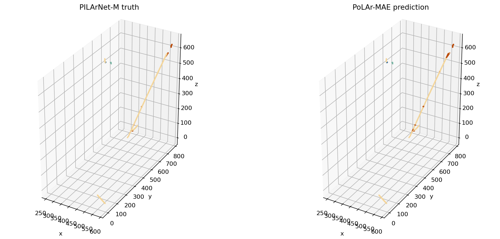

# Explore PoLAr-MAE

PoLAr-MAE groups detector hits into variable-sized tokens, masks some of those
tokens, and learns to reconstruct geometry and deposited energy. This tutorial
runs both released endpoints on **PILArNet-M-mini test event 0**:

| Checkpoint | pimm model | Result |
|---|---|---|
| [`PoLAr-MAE-Semantic`](https://huggingface.co/DeepLearnPhysics/PoLAr-MAE-Semantic) | {py:class}`~pimm.models.polarmae.polarmae_semseg.PoLArMAESemSeg` | four-class `seg_logits` for every retained point |
| [`PoLAr-MAE-Pretrain`](https://huggingface.co/DeepLearnPhysics/PoLAr-MAE-Pretrain) | {py:class}`~pimm.models.polarmae.polarmae.PoLArMAE` | masked geometry and energy reconstruction losses |

The scenes below are interactive Plotly figures regenerated in this checkout,
not screenshots copied from another repository. Drag to rotate, scroll to zoom,
hover for coordinates, and click legend entries to isolate a layer.

## 1. Load one mini event

The example downloads only the mini dataset's test HDF5 shard and builds two
views of event 0 with {py:func}`~pimm.datasets.builder.build_dataset` and
{py:func}`~pimm.datasets.utils.collate_fn`.

The semantic checkpoint normalizes coordinates inside
{py:meth}`~pimm.models.polarmae.polarmae_semseg.PoLArMAESemSeg.forward`, so its
pipeline leaves coordinates in detector units and log-transforms energy with
the release's `0.13` minimum:

```python
semantic_transform = [
    dict(type="LogTransform", min_val=0.13, max_val=20.0),
    dict(type="Copy", keys_dict={"segment_motif": "segment"}),
    dict(type="ToTensor"),
    dict(
        type="Collect",
        keys=("coord", "segment"),
        feat_keys=("coord", "energy"),
    ),
]
```

The pretraining checkpoint instead expects coordinates normalized before its
{py:meth}`~pimm.models.polarmae.polarmae.PoLArMAE.forward` call:

```python
pretrain_transform = [
    dict(type="LogTransform", min_val=0.01, max_val=20.0),
    dict(
        type="NormalizeCoord",
        center=[384.0, 384.0, 384.0],
        scale=768.0 * 3**0.5 / 2,
    ),
    dict(type="ToTensor"),
    dict(
        type="Collect",
        keys=("coord", "energy"),
        feat_keys=("coord", "energy"),
    ),
]
```

These are two scientific contracts for two checkpoints, not interchangeable
“PoLAr-MAE preprocessing.” The complete dataset construction is in the
downloadable source.

## 2. Run semantic inference

Load the model with {py:func}`~pimm.from_pretrained`, omit the target from the
model input, and call the module itself:

```python
import torch
import pimm

model_input = {
    key: semantic_batch[key].to(device)
    for key in ("coord", "feat", "offset")
}
model = pimm.from_pretrained(
    "DeepLearnPhysics/PoLAr-MAE-Semantic",
    device=device,
)

with torch.inference_mode():
    output = model(model_input)

logits = output["seg_logits"]
prediction = logits.argmax(dim=-1)
```

The checked-in CPU run produced:

```text
logits: (1141, 4)
predicted class counts: [39, 849, 24, 229]
truth class counts:     [39, 964, 18, 120, 0]
```

The four model classes are shower, track, Michel, and delta. The fifth truth
bin is the LED class; it is empty after the release's low-energy-scatter
filter.

<iframe
  title="Interactive PoLAr-MAE semantic truth and prediction"
  src="../_static/tutorials/polarmae-semantic.html"
  class="pimm-plotly-frame pimm-plotly-frame-wide"
  loading="lazy"
></iframe>

<noscript>
  
</noscript>

:::{important}
[`PILArNet-M-mini`](https://huggingface.co/datasets/DeepLearnPhysics/PILArNet-M-mini)
contains revision-v2 events, while the published semantic benchmark used
PILArNet v1. This is a real inference smoke test, not a reproduction of the
paper's split-wide metric.
:::

## 3. Inspect masked reconstruction

With seed `7`, the checked-in CPU run of the released pretraining checkpoint
reported:

| Quantity | Event-0 value |
|---|---:|
| total loss | `0.175442` |
| Chamfer loss | `0.130922` |
| energy loss | `0.044520` |

The configured objective is
$L = w_{\mathrm{chamfer}}L_{\mathrm{chamfer}} +
w_{\mathrm{energy}}L_{\mathrm{energy}}$.
One stochastic event is useful for checking a pipeline, not for comparing
models; an evaluation must fix the mask protocol and aggregate a declared
split.

<iframe
  title="Interactive PoLAr-MAE masked reconstruction"
  src="../_static/tutorials/polarmae-reconstruction.html"
  class="pimm-plotly-frame"
  loading="lazy"
></iframe>

Black points are visible groups and red points are reconstructed masked groups.
The blue masked targets start hidden; click their legend entry to compare them
directly with the reconstruction.

The public forward result contains losses and group statistics. The tutorial's
`trace_pretrain_model(...)` helper calls the released model's tokenizer,
encoder, decoder, and heads once while retaining the intermediate points needed
for this scientific visualization. Because that analysis uses submodules rather
than only the public forward contract, pin the pimm commit if you adopt it in a
study.

## 4. Explore token representations

{py:func}`~pimm.models.polarmae.data.packed_to_batched` converts the packed
event to PoLAr-MAE's padded representation. The figure pipeline then groups hits,
embeds every valid group, adds positional embeddings, and runs the transformer
encoder. It compresses the token features to three display channels with PCA.

Position can dominate the color map because the encoder deliberately receives
position. The right panel fits the linear model
$\mathbf e_i = W\mathbf p_i + \mathbf b + \boldsymbol\epsilon_i$ and plots PCA
of the residual $\boldsymbol\epsilon_i$.

<iframe
  title="Interactive PCA views of PoLAr-MAE token representations"
  src="../_static/tutorials/polarmae-representations.html"
  class="pimm-plotly-frame pimm-plotly-frame-wide"
  loading="lazy"
></iframe>

Residualization is a visualization aid, not evidence of semantic
disentanglement: it removes only linear position dependence, and PCA retains
only three directions. Use held-out probes for quantitative representation
comparisons.

## Continue to an experiment

- Train the released task architecture: {doc}`Semantic segmentation
  <semantic_segmentation>`.
- Freeze or adapt the encoder: {doc}`Parameter-efficient fine-tuning <peft>`.
- Check the exact model input contracts: {doc}`Pretrained models
  <../models/pretrained>`.
- Reproduce split-wide metrics: {doc}`Evaluation <../workflows/evaluate>`.
